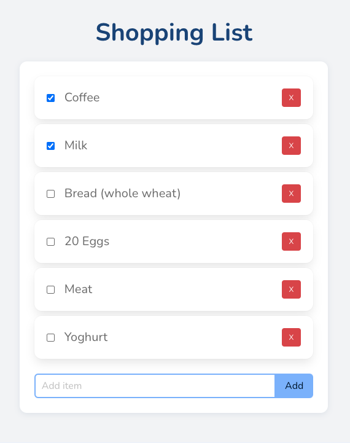

# BETH Stack with Bulma

An opinionated hypermedia-driven web framework that prioritizes developer experience while still having amazing performance.

This tech stack consists of:

- Bun https://bun.sh
- ElysiaJS https://elysiajs.com/
- Turso (SQLite) https://docs.turso.tech
- HTMX https://htmx.org/
---
- SQLite https://www.sqlite.org
- Drizzle ORM: https://orm.drizzle.team
- TypeScript https://www.typescriptlang.org/docs/
- JSX templates https://www.typescriptlang.org/docs/handbook/jsx.html
- Hyperscript https://hyperscript.org
- Bulma CSS https://bulma.io



## Resources

- The BETH Stack is based on the Medium article [here](https://medium.com/@wezzcoetzee/the-beth-stack-c5887a606ed3)

- The static site is based on the Bulma Tropico template: [restylianos/bulma-tropico-template: Bulma tropico template 🍍](https://github.com/restylianos/bulma-tropico-template)

### Commands

- There is no build step required for TypeScript and JSX. Bulma only requires a build step when customizing the theme.

Run the server

```
bun run start
```

Kill the server

```
lsof -t -i :3000 | xargs kill
```

### Customize Bulma with Sass

- https://bulma.io/documentation/customize/with-sass/

Use either

```
bun run build:bulma
bun run dev:bulma
```

### Database

- https://orm.drizzle.team/docs/tutorials/drizzle-with-turso

View Database

```
bunx drizzle-kit studio
```

### Deployment

- via Fly.io

### TODO
- Create an HTMX/JSX Version of the Tropico index.html template with a mobile dropdown menu
- Add custom 404 page.
- add domain

### Potential Issues

- Security: There's no path sanitization to prevent directory traversal attacks. Consider validating the page parameter to ensure it doesn't contain characters like ../.